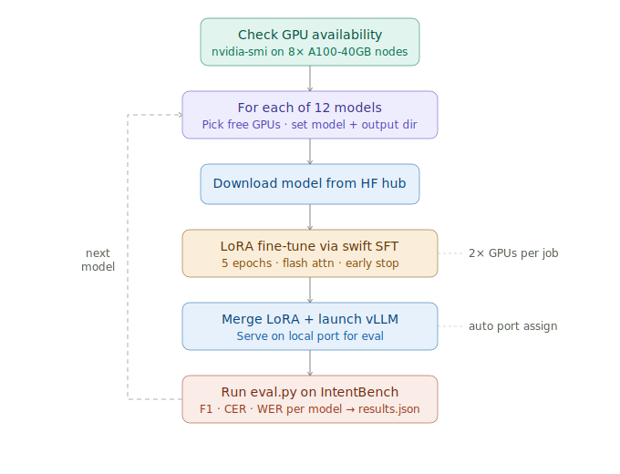

# ML Intern

An ML intern that autonomously researches, writes, and ships ML code using the Hugging Face ecosystem — with deep access to docs, papers, datasets, and cloud compute.

## Pipeline



## Quick Start

```bash
git clone git@github.com:akshataaabhat/ml-intern.git
cd ml-intern
uv sync
uv tool install -e .
```

Create a `.env` file:

```bash
ANTHROPIC_API_KEY=<your-anthropic-api-key>
HF_TOKEN=<your-hugging-face-token>
GITHUB_TOKEN=<github-personal-access-token>
```

## Usage

```bash
# Interactive
ml-intern

# Headless
ml-intern "fine-tune llama on my dataset"

# Options
ml-intern --model anthropic/claude-opus-4-6 "your prompt"
ml-intern --max-iterations 100 "your prompt"
```

## Architecture

Three components:

- **Agent** (`agent/`) — agentic loop, tools, context management, doom-loop detector
- **Backend** (`backend/`) — FastAPI server, auth, sessions, user quotas
- **Frontend** (`frontend/`) — React/TypeScript chat UI with code panel

The agent runs an iteration loop (max 300 steps): LLM call → parse tool calls → approval check → execute via ToolRouter → repeat.

## Session Traces

Every session is auto-uploaded to your own private HuggingFace dataset, viewable in the [HF Agent Trace Viewer](https://huggingface.co/changelog/agent-trace-viewer).

```bash
/share-traces            # show current visibility + dataset URL
/share-traces public     # publish
/share-traces private    # lock back down
```

## Slack Notifications

```bash
SLACK_BOT_TOKEN=xoxb-...
SLACK_CHANNEL_ID=C...
```

Notifies on approval required, error, and turn complete events.

## Development

**Add a tool** — edit `agent/core/tools.py` and add a `ToolSpec` to `create_builtin_tools()`.

**Add an MCP server** — edit `configs/cli_agent_config.json`:

```json
{
  "mcpServers": {
    "your-server": {
      "transport": "http",
      "url": "https://example.com/mcp"
    }
  }
}
```