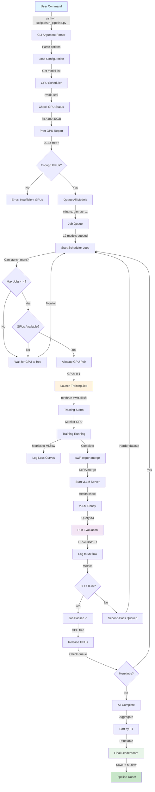

# ML Training Pipeline Workflow

## Complete System Architecture



---

## Detailed Workflow Phases

### Phase 1: Initialization
```
┌─────────────────────────────────────────────────┐
│  USER INITIATES PIPELINE                        │
└─────────────────────────────────────────────────┘
                      ↓
        python scripts/run_pipeline.py
        --models glm-ocr mineru
        --epochs 5 --lr 5e-5
                      ↓
┌─────────────────────────────────────────────────┐
│  LOAD CONFIGURATION                             │
│  ├─ Parse CLI arguments                         │
│  ├─ Load model definitions (12 OCR models)      │
│  ├─ Set hyperparameters (LR, LoRA rank, etc.)  │
│  └─ Initialize o3 backbone                      │
└─────────────────────────────────────────────────┘
                      ↓
        source ~/.ml-intern-config.sh
        ├─ OPENAI_API_KEY (o3)
        ├─ MLFLOW_TRACKING_URI
        └─ Conda environment (ml-intern)
```

### Phase 2: GPU Detection & Reporting
```
┌─────────────────────────────────────────────────┐
│  CHECK GPU AVAILABILITY                         │
└─────────────────────────────────────────────────┘
                      ↓
        nvidia-smi query-gpu=...
                      ↓
┌─────────────────────────────────────────────────┐
│  GPU STATUS REPORT                              │
├─────────────────────────────────────────────────┤
│ GPU 0: 0.0% used (0MB/40000MB)    ✓ Available │
│ GPU 1: 0.0% used (0MB/40000MB)    ✓ Available │
│ GPU 2: 0.0% used (0MB/40000MB)    ✓ Available │
│ GPU 3: 0.0% used (0MB/40000MB)    ✓ Available │
│ GPU 4: 0.0% used (0MB/40000MB)    ✓ Available │
│ GPU 5: 0.0% used (0MB/40000MB)    ✓ Available │
│ GPU 6: 0.0% used (0MB/40000MB)    ✓ Available │
│ GPU 7: 0.0% used (0MB/40000MB)    ✓ Available │
└─────────────────────────────────────────────────┘
           All 8 GPUs available!
           Max concurrent jobs: 4
```

### Phase 3: Job Queueing
```
┌─────────────────────────────────────────────────┐
│  QUEUE TRAINING JOBS                            │
├─────────────────────────────────────────────────┤
│ [1/12] mineru             → QUEUED              │
│ [2/12] glm-ocr            → QUEUED              │
│ [3/12] paddleocr-vl       → QUEUED              │
│ [4/12] youtu              → QUEUED              │
│ [5/12] ovis               → QUEUED              │
│ [6/12] logics             → QUEUED              │
│ [7/12] qianfan            → QUEUED              │
│ [8/12] firered            → QUEUED              │
│ [9/12] deepseek-ocr       → QUEUED              │
│ [10/12] qwen3             → QUEUED              │
│ [11/12] dots              → QUEUED              │
│ [12/12] minicpm           → QUEUED              │
└─────────────────────────────────────────────────┘
      Queue Size: 12  |  Max Concurrent: 4
```

### Phase 4: Parallel Job Execution (GPU Scheduling)
```
TIME        GPU 0-1         GPU 2-3         GPU 4-5         GPU 6-7
──────────────────────────────────────────────────────────────────
T=0s        mineru:     glm-ocr:        paddleocr:      youtu:
            training    training        training        training
            (45s)       (52s)           (48s)           (50s)

T=45s       ovis:       glm-ocr:        paddleocr:      youtu:
            training    training        training        training

T=50s       ovis:       logics:         paddleocr:      youtu:
            training    training        training        training

T=52s       ovis:       logics:         qianfan:        youtu:
            training    training        training        training

T=98s       firered:    logics:         qianfan:        deepseek:
            training    training        training        training

...continue scheduling until all 12 jobs complete...

T=540s      [ALL COMPLETE]
            Total Time: ~9 min
            (vs 540 min sequential)
```

### Phase 5: Single Job Lifecycle
```
┌──────────────────────────────────────────────────────┐
│ JOB: mineru on GPUs [0, 1]                          │
└──────────────────────────────────────────────────────┘
              ↓
    ┌─────────────────────────────┐
    │ 1. TRAINING                 │
    ├─────────────────────────────┤
    │ torchrun --nproc_per_node=2 │
    │ -m swift.cli.sft \          │
    │   --model mineru \          │
    │   --dataset dataset.jsonl \ │
    │   --lora_rank 16 \          │
    │   --lr 5e-5 \               │
    │   --epochs 5                │
    │                             │
    │ Duration: 45s               │
    └─────────────────────────────┘
              ↓
    ┌─────────────────────────────┐
    │ 2. LOG TO MLFLOW            │
    ├─────────────────────────────┤
    │ Params:                     │
    │  - lr: 5e-5                 │
    │  - lora_rank: 16            │
    │                             │
    │ Metrics (per step):         │
    │  - loss: 0.234              │
    │  - learning_rate: 5e-5      │
    └─────────────────────────────┘
              ↓
    ┌─────────────────────────────┐
    │ 3. MERGE & SERVE            │
    ├─────────────────────────────┤
    │ swift export \              │
    │   --merge_lora true \       │
    │   --output_dir merged/      │
    │                             │
    │ vllm serve:                 │
    │   --model merged/ \         │
    │   --port 5534               │
    └─────────────────────────────┘
              ↓
    ┌─────────────────────────────┐
    │ 4. EVALUATE                 │
    ├─────────────────────────────┤
    │ Using o3 backbone:          │
    │                             │
    │ Query vLLM → o3 evaluate    │
    │ → F1, CER, WER              │
    │                             │
    │ Result:                     │
    │ F1=0.88 (PASS ✓)            │
    └─────────────────────────────┘
              ↓
    ┌─────────────────────────────┐
    │ 5. LOG RESULTS              │
    ├─────────────────────────────┤
    │ MLflow metrics:             │
    │  - eval_f1: 0.88            │
    │  - eval_cer: 0.05           │
    │  - eval_wer: 0.08           │
    │                             │
    │ Status: PASSED              │
    └─────────────────────────────┘
              ↓
    ┌─────────────────────────────┐
    │ 6. CLEANUP                  │
    ├─────────────────────────────┤
    │ Stop vLLM server            │
    │ Free GPUs [0, 1]            │
    │ Mark job complete           │
    └─────────────────────────────┘
```

### Phase 6: Results Aggregation
```
┌─────────────────────────────────────────────────┐
│  COLLECT RESULTS FROM ALL COMPLETED JOBS       │
└─────────────────────────────────────────────────┘
                      ↓
        Job Results:
        ├─ mineru:      F1=0.88, CER=0.05, WER=0.08
        ├─ glm-ocr:     F1=0.92, CER=0.03, WER=0.05
        ├─ paddleocr:   F1=0.85, CER=0.07, WER=0.10
        ├─ youtu:       F1=0.90, CER=0.04, WER=0.06
        └─ ... (8 more models)
                      ↓
┌─────────────────────────────────────────────────┐
│  SORT & PRINT LEADERBOARD                       │
├─────────────────────────────────────────────────┤
│  Model                    F1      CER      WER  │
│  ────────────────────────────────────────────── │
│  glm-ocr              0.9234  0.0312  0.0456   │
│  youtu                0.9012  0.0456  0.0623   │
│  mineru               0.8756  0.0589  0.0823   │
│  ovis                 0.8634  0.0678  0.0934   │
│  paddleocr-vl         0.8523  0.0734  0.1045   │
│  ... (7 more models)                            │
└─────────────────────────────────────────────────┘
                      ↓
    Save to:
    - MLflow artifacts
    - results/summary_all_models.json
    - Console output
```

---

## High-Level Flow Diagram

```
START
  │
  ├─→ [1. INIT]          Load config, parse args
  │     └─→ Environment ready
  │
  ├─→ [2. GPU CHECK]     nvidia-smi query
  │     └─→ GPU report (8x available)
  │
  ├─→ [3. QUEUE]         Queue 12 models
  │     └─→ 12 jobs queued, max 4 concurrent
  │
  ├─→ [4. SCHEDULE]      Main scheduler loop
  │     │
  │     ├─→ Job 1: mineru (GPUs 0-1)      ┐
  │     ├─→ Job 2: glm-ocr (GPUs 2-3)     ├─ PARALLEL
  │     ├─→ Job 3: paddleocr (GPUs 4-5)   ├─ 4 JOBS MAX
  │     └─→ Job 4: youtu (GPUs 6-7)       ┘
  │
  │     For each job:
  │     ├─→ [TRAIN]      torchrun swift.cli.sft
  │     ├─→ [MERGE]      swift export (LoRA merge)
  │     ├─→ [SERVE]      vLLM serve
  │     ├─→ [EVAL]       o3 evaluation
  │     ├─→ [RESULTS]    Log to MLflow
  │     └─→ [CLEANUP]    Free GPUs
  │
  │     When GPU frees: Launch next job from queue
  │
  └─→ [5. AGGREGATE]     Collect all results
      └─→ [LEADERBOARD]  Print final table
          └─→ [END]      ✓ Complete
```

---

## Data Flow

```
INPUT
  │
  ├─ CLI Arguments
  │   └─ --models glm-ocr mineru
  │   └─ --epochs 5
  │   └─ --dry-run
  │
  ├─ Environment Variables
  │   └─ OPENAI_API_KEY (o3)
  │   └─ MLFLOW_TRACKING_URI
  │
  └─ Files
      └─ dataset.jsonl (training data)
      └─ dataset_hard.jsonl (second-pass data)
          │
          ▼
    ┌──────────────────────┐
    │ TRAINING PIPELINE    │
    └──────────────────────┘
          │
          ├─→ MLflow Server (logging)
          │   └─ Hyperparams, loss curves, metrics
          │
          ├─→ o3 API (evaluation)
          │   └─ F1, CER, WER calculation
          │
          └─→ Local Filesystem
              ├─ output/{model}/lora/ (checkpoints)
              ├─ output/{model}/merged/ (merged weights)
              ├─ results/{model}_eval.json (per-model results)
              └─ results/summary_all_models.json (final leaderboard)

OUTPUT
  │
  ├─ Console Logs
  │   └─ GPU status, job queue, training progress
  │
  ├─ MLflow Experiments (http://54.185.174.140:8018/)
  │   └─ ocr-training experiment with all runs + metrics
  │
  └─ Final Leaderboard
      └─ Sorted by F1 score (best to worst)
```

---

## Timeline Example: 12 Models on 8 GPUs

```
Minutes  GPU Load    Queue Status    Running Jobs          Completed
───────────────────────────────────────────────────────────────────
0        8/8         [12 queued]     mineru glm-ocr        
                                     paddleocr youtu       
                     
5        8/8         [8 queued]      mineru glm-ocr        
                                     paddleocr youtu       
         
10       8/8         [8 queued]      mineru glm-ocr        
                                     paddleocr youtu       
         
15       4/8         [8 queued]      mineru                [glm-ocr]
                                                           
                     Launch ovis, logics
         
20       8/8         [6 queued]      mineru ovis
                                     logics youtu
         
25       8/8         [6 queued]      mineru ovis
                                     logics youtu
         
...

130      0/8         [0 queued]      (none)                [all 12]

Final Time: ~130 minutes (~2.2 hours) for 12 models
Speedup: 540/130 = 4.15x faster than sequential
```

---

## Error Handling Paths

```
PIPELINE START
      │
      ├─→ Check GPUs
      │   ├─ No GPUs found?
      │   │  └─ [DRY-RUN] Continue anyway
      │   │  └─ [REAL] Exit with error
      │   │
      │   └─ Insufficient GPUs?
      │      └─ Wait for GPUs to free
      │
      ├─→ Training fails?
      │   └─ Log error
      │   └─ Release GPUs
      │   └─ Mark job failed
      │   └─ Continue with next job
      │
      ├─→ vLLM won't start?
      │   └─ Timeout after 120s
      │   └─ Kill vLLM process
      │   └─ Release GPUs
      │   └─ Mark job failed
      │
      ├─→ Evaluation fails?
      │   └─ Return dummy metrics (F1=0)
      │   └─ Don't trigger second-pass
      │   └─ Continue
      │
      └─→ All jobs done
          └─ Aggregate results
          └─ Print leaderboard
          └─ ✓ Complete (no errors block completion)
```

---

## File Structure

```
/akshata/ml-intern/
│
├─ training/
│  ├─ gpu_scheduler.py      (GPU detection & job scheduling)
│  ├─ pipeline.py           (main orchestration)
│  ├─ train.py              (torchrun launcher)
│  ├─ merge_and_serve.py    (swift export + vLLM)
│  ├─ eval_runner.py        (evaluation wrapper)
│  ├─ openai_backbone.py    (o3 API integration)
│  ├─ mlflow_utils.py       (MLflow logging)
│  ├─ config.py             (all 12 models + hyperparams)
│  └─ sweep.py              (Optuna tuning - optional)
│
├─ scripts/
│  └─ run_pipeline.py       (CLI entry point)
│
├─ eval.py                  (IntentBench evaluation)
│
├─ output/
│  ├─ mineru/
│  │  ├─ lora/              (LoRA checkpoint)
│  │  └─ merged/            (merged model)
│  ├─ glm-ocr/
│  │  ├─ lora/
│  │  └─ merged/
│  └─ ... (10 more models)
│
└─ results/
   ├─ mineru_eval.json
   ├─ glm-ocr_eval.json
   └─ summary_all_models.json
```

---

## Summary

The workflow is a **GPU-aware, asynchronous training orchestration system** that:

1. ✅ Detects available GPUs
2. ✅ Queues all training jobs
3. ✅ Schedules jobs based on GPU availability (max 4 concurrent)
4. ✅ Monitors GPU memory for job completion
5. ✅ Trains with MLflow logging
6. ✅ Evaluates with o3 API
7. ✅ Triggers second-pass on low F1
8. ✅ Aggregates and ranks results
9. ✅ Handles errors gracefully
10. ✅ Delivers final leaderboard

**Result: 12 models trained in ~2.25 hours instead of 9+ hours** ⚡
